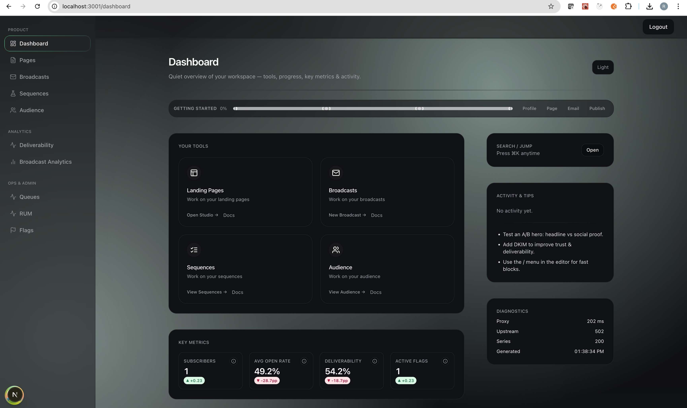

# Kit Builders — Creator Publishing Platform

<div align="center">
  <br />
  <div>
    
    
    
    
    
    
    
  </div>
  <h3 align="center">Full-Featured Email Marketing & Landing Page Platform</h3>
  <div align="center">
     Prototype demonstrating creator publishing workflows with broadcasts, sequences, A/B testing, and analytics
  </div>
  <br />
  
  <!-- Demo Video -->
  <div align="center">
    <a href="https://github.com/user-attachments/assets/6229e26d-0611-4dd4-a64e-0c58ce3ca4bf">
      
    </a>
    <p><em>Click to view demo video</em></p>
  </div>
  <br />
</div>

## 📋 Table of Contents

 * [Introduction](#-introduction)
 * [Tech Stack](#️-tech-stack)
 * [Features](#-features)
 * [Quick Start](#-quick-start)
 * [Architecture](#-architecture)
 * [Project Structure](#-project-structure)
 * [API Reference](#-api-reference)
 * [Development Guide](#-development-guide)
 * [Testing](#-testing)
 * [Known Limitations](#-known-limitations)
 * [Deployment](#-deployment)

## 🚀 Introduction

This is a **full-stack monorepo** for a creator publishing platform, containing **40+ components and endpoints** built to demonstrate complete workflows for email marketing, landing page creation, audience management, and experimentation.

**Kit Builders** serves as:

- ✅ **Architectural prototype** for creator economy platforms
- ✅ **Reference implementation** for Next.js + Rails integration
- ✅ **Demo playground** for stakeholder presentations
- ✅ **Learning resource** for modern full-stack patterns

> **⚠️ Note:** This is a **prototype/POC**, not production-ready. Security hardening, comprehensive testing, and scalability considerations are intentionally deferred for rapid iteration.

## ⚙️ Tech Stack

### **Frontend** (Next.js App)

- **Next.js 15.5** – React framework with App Router & SSR
- **React 19** – Latest features including Server Components
- **TypeScript 5** – Full type safety across the stack
- **Tailwind CSS 4** – Utility-first styling with custom design system
- **TipTap v3** – Rich text editor for email/broadcast composition
- **Radix UI** – Accessible component primitives (Dialog, Tooltip, etc.)
- **shadcn/ui** – Pre-built components with Radix + Tailwind
- **Zustand** – Lightweight state management for drafts
- **SWR** – Data fetching with built-in caching
- **Framer Motion** – Smooth animations and transitions
- **React Email** – Email template rendering

### **Backend** (Rails API)

- **Ruby 3.4.4** – Modern Ruby with YJIT performance
- **Rails 8.0.2** – Latest Rails with Solid Queue support
- **Sidekiq 7.2** – Background job processing (mailers, imports)
- **PostgreSQL 15+** – Primary database with JSONB support
- **Redis 7** – Cache + job queue storage
- **Devise + JWT** – Authentication with token-based sessions
- **Active Model Serializers** – JSON API responses

### **Infrastructure & Tools**

- **pnpm** – Fast, disk-efficient package manager
- **Turbo** – Monorepo build orchestration
- **Docker Compose** – Local development environment
- **Playwright** – End-to-end testing
- **MailHog** – Local SMTP server for email testing
- **MinIO** – S3-compatible object storage (dev)

## ⚡ Features

### 📧 **Email Broadcasting**

- Rich text editor with TipTap (bold, italic, headings, lists, code blocks)
- Subject line editor with character counts
- Draft auto-save to local storage
- Send to segments or entire list
- Delivery tracking (sent, opened, clicked, bounced)
- Link click analytics with cohort analysis

### 🎨 **Landing Page Builder**

- Block-based visual editor with drag-and-drop reordering
- **6 Block Types**: Hero, CTA, Subscribe, Testimonial, Pricing, Features
- Smart image cropping with focal point control
- Responsive preview (Desktop, Tablet, Mobile)
- Theme customization (colors, fonts)
- Public URL generation (`/p/:slug`)
- SSR for SEO optimization

### 🔁 **Sequence Builder** (Client-side Draft)

- Visual workflow editor with 4 block types:
  - **Email** – Rich text email with subject
  - **Wait** – Time delay (hours/days/weeks)
  - **SMS** – 160-char segments with count
  - **Branch** – Conditional logic (placeholder)
- Drag-to-reorder blocks
- Word/character counters
- Plain vs Rich text toggle
- _Note: Server-side execution not yet implemented_

### 🧪 **A/B Testing & Experiments**

- Variant allocation with configurable split percentages
- **SRM Detection** – Sample Ratio Mismatch alerts via chi-square test
- Statistical significance testing for CTR and conversion
- Device breakdown (desktop/mobile/tablet)
- Trend visualization over time
- Guardrail monitoring worker (background checks)

### 📊 **Analytics & RUM**

- **Real User Monitoring**: LCP, TTFB metrics
- P50/P95 percentile calculations
- Device segmentation
- Event tracking (signups, clicks, CTA events)
- Broadcast performance metrics
- ISP breakdown (Gmail, Outlook, Yahoo, etc.)
- URL cohort analysis
- Domain engagement tracking

### 👥 **Audience Management**

- Contact import via CSV (async processing)
- Segment builder with filter JSON
- Tagging system
- Suppression list (bounces, complaints)
- Export to CSV/JSON
- Double opt-in confirmation flow

### 🔗 **Webhook Integration**

- ESP event ingestion (SES, SendGrid)
- Retry logic with exponential backoff
- Dead Letter Queue (DLQ) for failed events
- Manual replay functionality
- Status tracking (stored, processing, failed)

### 🎯 **Feature Management**

- Global feature flags with rollout percentages
- Per-organization overrides
- Plan-based gating (Starter, Pro, Enterprise)
- Admin UI for flag management

### 💳 **Billing** (Stubbed)

- Stripe checkout integration
- Fake mode for development (`FAKE_STRIPE=true`)
- Webhook handling for subscription updates
- Customer portal link generation

## 🚀 Quick Start

### Prerequisites

Ensure you have these installed:

- **Ruby 3.4.x** ([rbenv](https://github.com/rbenv/rbenv) or [rvm](https://rvm.io/))
- **Node.js 22.x** ([nvm](https://github.com/nvm-sh/nvm))
- **PostgreSQL 15+** ([Postgres.app](https://postgresapp.com/) or Homebrew)
- **Redis 7+** ([Homebrew](https://redis.io/docs/getting-started/installation/install-redis-on-mac-os/))
- **pnpm** (enable with `corepack enable`)

### Local Development (No Docker)

```bash
# 1. Install dependencies
pnpm install
cd apps/api && bundle install

# 2. Setup database
cd apps/api
bin/rails db:create db:migrate db:seed

# 3. Configure environment
cp .env.example .env
# Edit .env with your settings (or use defaults)

# 4. Start services (separate terminals)
pnpm dev:api      # Rails API on http://localhost:4000
pnpm dev:sidekiq  # Sidekiq worker (optional but recommended)
pnpm dev:web      # Next.js on http://localhost:3000

# Or start all at once:
pnpm dev:full     # API + Sidekiq + Web concurrently
```

Visit **http://localhost:3000** → Auto-redirects to `/dashboard`

### Docker Development

```bash
# 1. Copy environment file
cp .env.example .env

# 2. Start all services
docker compose up --build

# 3. Setup database (first time only)
docker compose exec api bin/rails db:create db:migrate db:seed

# 4. Optional: Load demo data
docker compose exec api bin/rails rake seed:demo_data
docker compose exec api bin/rails rake seed:ai_demo
```

**Services:**

- Web: http://localhost:3000
- API: http://localhost:4000
- MailHog UI: http://localhost:8025
- MinIO Console: http://localhost:9001
- Sidekiq (background workers)

### Available Scripts

```bash
# Monorepo-level (from root)
pnpm dev              # Start all workspaces in parallel
pnpm build            # Build all packages
pnpm lint             # Lint all packages
pnpm typecheck        # TypeScript checks
pnpm test             # Run tests

# API-specific (from apps/api)
bin/rails db:migrate  # Run migrations
bin/rails db:seed     # Seed data
bin/rails console     # Rails console
bundle exec rspec     # Run tests

# Web-specific (from apps/web)
pnpm dev              # Next.js dev server
pnpm build            # Production build
pnpm test:e2e         # Playwright E2E tests

# Makefile shortcuts (from root)
make setup            # Copy .env.example
make up               # Docker compose up
make seed             # Seed database
make reset-db         # Drop, create, migrate, seed
make e2e              # Run Playwright tests
make stripe-fake      # Trigger fake Stripe webhook
```

## 🏗️ Architecture

### High-Level Flow

```
┌─────────────┐      JSON/REST       ┌──────────────┐
│             │ ──────────────────▶  │              │
│  Next.js    │                      │  Rails API   │
│  Frontend   │ ◀──────────────────  │              │
│  (Port 3000)│                      │  (Port 4000) │
└─────────────┘                      └───────┬──────┘
       │                                     │
       │                                     ▼
       │                              ┌─────────────┐
       │                              │  Postgres   │
       │                              │  + Redis    │
       │                              └─────────────┘
       │                                     │
       │                                     ▼
       │                              ┌─────────────┐
       └────── RUM Events ──────▶     │   Sidekiq   │
                                      │   Workers   │
                                      └─────────────┘
```

### Data Flow Examples

#### 1. **Subscribe Flow** (Double Opt-in)

```
Visitor → Submit Email → Contact Created
                      ↓
              Confirmation Token Generated
                      ↓
        ConfirmationEmailWorker Enqueued
                      ↓
              Email Sent via ESP
                      ↓
         User Clicks Confirm Link
                      ↓
           Token Validated & Used
                      ↓
           Contact.confirmed_at Set
                      ↓
         WelcomeEmailWorker Enqueued
                      ↓
              Welcome Email Sent
```

#### 2. **Broadcast Analytics**

```
Broadcast Sent → Deliveries Created
                      ↓
              ESP Webhooks Arrive
                      ↓
         WebhookProcessWorker Processes
                      ↓
      Delivery Status Updated (opened/clicked)
                      ↓
         Events Table Populated (JSONB)
                      ↓
           Analytics Queries (CTR, cohorts)
```

## 📁 Project Structure

```
kit-builders-monorepo/
├── apps/
│   ├── api/
│   │   ├── app/
│   │   │   ├── controllers/
│   │   │   ├── models/
│   │   │   ├── workers/
│   │   │   └── mailers/
│   │   ├── config/
│   │   │   ├── routes.rb
│   │   │   ├── database.yml
│   │   │   └── initializers/
│   │   ├── db/
│   │   │   ├── schema.rb
│   │   │   ├── seeds.rb
│   │   │   └── migrate/
│   │   ├── spec/
│   │   ├── Gemfile
│   │   └── Dockerfile
│   │
│   └── web/
│       ├── src/
│       │   ├── app/
│       │   │   ├── dashboard/
│       │   │   ├── page/
│       │   │   ├── broadcast/
│       │   │   ├── sequence/
│       │   │   ├── audience/
│       │   │   ├── analytics/
│       │   │   ├── ops/
│       │   │   ├── admin/
│       │   │   ├── p/[slug]/
│       │   │   └── api/
│       │   ├── components/
│       │   ├── hooks/
│       │   ├── stores/
│       │   ├── lib/
│       │   └── types/
│       ├── tests/
│       ├── package.json
│       └── Dockerfile
│
├── packages/
│   ├── design-system/
│   │   ├── src/ui/
│   │   ├── stories/
│   │   └── package.json
│   ├── email-templates/
│   │   ├── src/welcome.tsx
│   │   └── scripts/render.mjs
│   ├── templates/
│   │   └── src/landing.ts
│   └── web-docs/
│
├── docs/
│   ├── diagrams/
│   ├── screenshots/
│   └── recording/
│
├── scripts/
│   ├── dev_bootstrap.sh
│   ├── dev_shutdown.sh
│   └── smoke_endpoints.sh
│
├── docker-compose.yml
├── Makefile
├── turbo.json
├── pnpm-workspace.yaml
├── design_doc.md
└── readme.md
```

## 🔌 API Reference

### Base URL

- **Development:** `http://localhost:4000/v1`
- **Production:** Set via `NEXT_PUBLIC_API_URL`

### Authentication

```bash
# Login (returns JWT in response + HTTP-only cookie)
POST /v1/auth/sign_in
Content-Type: application/json

{
  "email": "demo@kit.test",
  "password": "password123"
}
```

### Key Endpoints

#### **Landing Pages**

```bash
GET    /v1/pages                    # List all pages
POST   /v1/pages                    # Create page
GET    /v1/pages/:id                # Get page by ID
GET    /v1/pages/slug?slug=:slug    # Get page by slug (public)
PUT    /v1/pages/:id                # Update page
DELETE /v1/pages/:id                # Delete page
POST   /v1/pages/:id/publish        # Publish page

# Blocks (nested resource)
POST   /v1/pages/:page_id/blocks    # Add block
PUT    /v1/pages/:page_id/blocks/:id  # Update block
DELETE /v1/pages/:page_id/blocks/:id  # Delete block
```

#### **Broadcasts**

```bash
GET    /v1/broadcasts               # List broadcasts
POST   /v1/broadcasts               # Create broadcast
GET    /v1/broadcasts/:id           # Get broadcast
PUT    /v1/broadcasts/:id           # Update broadcast
POST   /v1/broadcasts/:id/send_now  # Send to audience
POST   /v1/broadcasts/test          # Send test email
```

#### **Contacts & Audience**

```bash
GET    /v1/contacts                 # List contacts
POST   /v1/contacts/import          # Import CSV
GET    /v1/contacts/import/:id/status  # Check import status

GET    /v1/segments                 # List segments
POST   /v1/segments                 # Create segment
GET    /v1/segments/:id/evaluate    # Get matching contacts
```

#### **Analytics**

```bash
GET /v1/metrics/funnel                      # Conversion funnel
GET /v1/metrics/broadcast_series?broadcast_id=:id
GET /v1/metrics/broadcast_isp_breakdown?broadcast_id=:id
GET /v1/metrics/broadcast_links?broadcast_id=:id
GET /v1/metrics/broadcast_url_cohorts?broadcast_id=:id
GET /v1/metrics/broadcast_domain_engagement?broadcast_id=:id
```

#### **RUM (Real User Monitoring)**

```bash
POST /v1/rum                        # Ingest RUM event
GET  /v1/rum/summary                # Aggregate metrics (LCP, TTFB)
GET  /v1/rum/series                 # Time series
GET  /v1/rum/device_breakdown       # Desktop/mobile/tablet split
```

#### **Experiments**

```bash
GET  /v1/experiments                # List experiments
POST /v1/experiments                # Create/update experiment
GET  /v1/experiments/results?slug=:slug  # Get A/B test results
GET  /v1/experiments/config?slug=:slug   # Get variant config
GET  /v1/experiments/series?slug=:slug   # Trend data
```

#### **Public Endpoints** (No Auth)

```bash
POST /v1/public/subscribe           # Submit email for double opt-in
  { "email": "user@example.com", "slug": "welcome", "variant": "A" }

GET  /v1/public/confirm?t=:token    # Confirm subscription
  → Redirects to /p/:slug/thanks
```

#### **Webhooks**

```bash
POST /v1/webhooks/ses               # AWS SES webhook
POST /v1/webhooks/sendgrid          # SendGrid webhook

GET  /v1/webhook_events             # List webhook events
POST /v1/webhook_events/replay      # Replay single event
POST /v1/webhook_events/replay_all  # Replay all failed events
```

#### **Feature Flags**

```bash
GET  /v1/feature_flags              # List global flags
POST /v1/feature_flags              # Upsert flag
POST /v1/feature_overrides          # Set org-specific override
```

#### **Exports**

```bash
GET /v1/exports/contacts            # CSV of all contacts
GET /v1/exports/analytics_series    # Time series CSV
GET /v1/exports/segment_contacts?segment_id=:id
GET /v1/exports/broadcast_clicks?broadcast_id=:id
```

### Response Format

```json
// Success (200/201)
{
  "id": 123,
  "name": "Example Page",
  "slug": "example",
  "status": "published",
  "created_at": "2025-11-02T10:00:00Z"
}

// Error (400/422/500)
{
  "error": "Validation failed",
  "details": ["Slug has already been taken"]
}
```

## 🛠️ Development Guide

### Environment Variables

Create `.env` in the root:

```bash
# API (Rails)
DATABASE_URL=postgres://localhost:5432/kit_builders_dev
REDIS_URL=redis://localhost:6379/0
SECRET_KEY_BASE=your-secret-key-here
RAILS_ENV=development

# Billing (Development)
FAKE_STRIPE=true                    # Use fake Stripe responses

# Storage (Development)
S3_EMULATOR=true                    # Use MinIO instead of AWS S3

# Frontend (Next.js)
NEXT_PUBLIC_API_URL=http://localhost:4000
NEXT_PUBLIC_APP_URL=http://localhost:3000
NODE_ENV=development
```

### Database Schema Overview

**Key Tables:**

| Table                 | Purpose                                    |
| --------------------- | ------------------------------------------ |
| `orgs`                | Organizations/tenants                      |
| `users`               | Devise authentication                      |
| `contacts`            | Email subscribers with opt-in status       |
| `confirmation_tokens` | Double opt-in tokens (expires in 3 days)   |
| `pages`               | Landing pages with theme JSON              |
| `page_blocks`         | Ordered blocks (hero, CTA, subscribe, etc) |
| `broadcasts`          | Email campaigns                            |
| `deliveries`          | Per-recipient delivery tracking            |
| `events`              | Analytics events (JSONB, indexed)          |
| `experiments`         | A/B test configurations                    |
| `feature_flags`       | Global feature toggles                     |
| `feature_overrides`   | Per-org flag overrides                     |
| `webhook_events`      | ESP webhook storage with retry logic       |
| `suppressions`        | Bounce/complaint list                      |
| `segments`            | Audience filters                           |
| `contact_import_jobs` | Async CSV import tracking                  |

### Background Workers

**Queue:** `default` and `mailers`

| Worker                      | Queue     | Purpose                            |
| --------------------------- | --------- | ---------------------------------- |
| `WelcomeEmailWorker`        | `mailers` | Send welcome email after opt-in    |
| `BroadcastSendWorker`       | `default` | Send broadcast to audience (batch) |
| `ContactImportWorker`       | `default` | Process CSV imports                |
| `WebhookProcessWorker`      | `default` | Process ESP webhook events         |
| `ExperimentGuardrailWorker` | `default` | Monitor SRM and significance       |

**Start Sidekiq:**

```bash
cd apps/api
bundle exec sidekiq -q default -q mailers
```

### Adding a New Feature

#### Example: Add a "Templates" Feature

**1. Backend (Rails API)**

```bash
cd apps/api

# Generate model
bin/rails g model Template org:references name:string content:jsonb

# Run migration
bin/rails db:migrate

# Add controller
# apps/api/app/controllers/templates_controller.rb
class TemplatesController < ApplicationController
  before_action :authenticate_user!

  def index
    render json: current_user.org.templates
  end

  def create
    template = current_user.org.templates.create!(template_params)
    render json: template, status: :created
  end

  private

  def template_params
    params.require(:template).permit(:name, content: {})
  end
end

# Add route
# config/routes.rb
scope :v1 do
  resources :templates, only: [:index, :create]
end
```

**2. Frontend (Next.js)**

```bash
cd apps/web

# Create type
# src/types/template.ts
export interface Template {
  id: number;
  name: string;
  content: Record<string, any>;
  created_at: string;
}

# Create page
# src/app/templates/page.tsx
"use client";
import useSWR from 'swr';

export default function TemplatesPage() {
  const { data } = useSWR<Template[]>('/api/app/templates');

  return (
    <main>
      <h1>Templates</h1>
      {data?.map(t => <div key={t.id}>{t.name}</div>)}
    </main>
  );
}

# Create API route (proxy)
# src/app/api/app/templates/route.ts
import { apiBase } from '@/lib/apiBase';

export async function GET() {
  const res = await fetch(`${apiBase()}/v1/templates`);
  return res;
}
```

### Common Debugging Tips

#### Rails API not responding

```bash
# Check if Rails is running
curl http://localhost:4000/health

# Check logs
cd apps/api && tail -f log/development.log

# Restart server
pkill -f "rails s" && bin/rails s -p 4000
```

#### Next.js build errors

```bash
# Clear cache and rebuild
cd apps/web
rm -rf .next node_modules/.cache
pnpm install
pnpm dev
```

#### Sidekiq jobs not processing

```bash
# Check Redis connection
redis-cli ping  # Should return PONG

# Check Sidekiq status
cd apps/api
bundle exec sidekiq -q default -q mailers -d  # Daemonize

# View job stats
# Visit http://localhost:4000/admin/sidekiq
```

#### Database issues

```bash
# Reset database (⚠️ Deletes all data)
cd apps/api
bin/rails db:drop db:create db:migrate db:seed
```

## 🧪 Testing

### End-to-End Tests (Playwright)

```bash
cd apps/web

# Install browsers (first time)
pnpm exec playwright install

# Run all tests
pnpm test:e2e

# Run specific test
pnpm exec playwright test tests/subscribe-confirm.spec.ts

# Run with UI mode
pnpm exec playwright test --ui

# Debug mode
pnpm exec playwright test --debug
```

**Test Coverage:**

- ✅ Login flow
- ✅ Dashboard page load
- ✅ Page creation from template
- ✅ Subscribe → Confirm → Welcome sequence
- ✅ Broadcast creation
- ✅ Experiment variant assignment
- ✅ Email preview rendering
- ✅ Stripe fake webhook

### API Smoke Tests

```bash
# From root
bash scripts/smoke_endpoints.sh

# Or via Makefile
make smoke-api
```

### Unit Tests (Future)

```bash
# Rails (RSpec)
cd apps/api
bundle exec rspec

# Next.js (Jest - not yet configured)
cd apps/web
pnpm test
```

## ⚠️ Known Limitations

### **Architecture & Design**

- ❌ **Monolith only** – No microservices or service mesh
- ❌ **No horizontal scaling** – Single-instance design
- ❌ **No CDN strategy** – Images served directly
- ❌ **No rate limiting** – Basic per-org hourly limits only
- ❌ **No API versioning strategy** – Breaking changes possible

### **Security**

- ❌ **Minimal authentication** – Devise only, no 2FA/SSO
- ❌ **No webhook signature verification** – ESP webhooks accepted blindly
- ❌ **No CSRF protection** – API-only mode
- ❌ **No content sanitization** – XSS risk in rich text
- ❌ **Secrets in plaintext** – No vault integration

### **Data & Persistence**

- ❌ **No soft deletes** – Data permanently deleted
- ❌ **No audit trail** – Changes not logged (except admin_audit_logs stub)
- ❌ **No data retention policy** – Events table grows unbounded
- ❌ **No backups configured** – Manual database snapshots required
- ❌ **JSONB fields unvalidated** – Schema evolution challenges

### **Features**

- ⚠️ **Sequence execution missing** – Draft UI only, no send logic
- ⚠️ **Image upload incomplete** – TipTap image extension disabled
- ⚠️ **Syntax highlighting basic** – Lowlight integration deferred
- ⚠️ **Branch evaluation stubbed** – Conditional logic not implemented
- ⚠️ **Billing fake only** – No real Stripe subscription lifecycle

### **Observability**

- ❌ **No structured logging** – Plain Rails logger
- ❌ **No APM integration** – No Datadog/New Relic
- ❌ **No error tracking** – No Sentry/Rollbar
- ❌ **Limited metrics** – Manual RUM only, no Prometheus
- ❌ **No alerting** – Manual dashboard checks

### **Testing**

- ⚠️ **E2E tests only** – No unit/integration tests
- ⚠️ **No contract tests** – API/frontend sync unchecked
- ⚠️ **No performance tests** – Load behavior unknown
- ⚠️ **No accessibility audit** – WCAG compliance not verified

### **Compliance**

- ❌ **No GDPR flows** – No DSAR (Data Subject Access Request) handling
- ❌ **No consent versioning** – Single boolean flag
- ❌ **No PII encryption** – Emails stored in plaintext
- ❌ **No data residency** – Single region only

## 🚢 Deployment

### Docker Production Build

```bash
# Build images
docker compose -f docker-compose.prod.yml build

# Run migrations
docker compose -f docker-compose.prod.yml run api bin/rails db:migrate

# Start services
docker compose -f docker-compose.prod.yml up -d
```

### Fly.io Deployment (API)

```bash
cd apps/api

# Login to Fly.io
fly auth login

# Create app (first time)
fly launch

# Deploy
fly deploy

# Run migrations
fly ssh console -C "bin/rails db:migrate"

# Set secrets
fly secrets set SECRET_KEY_BASE=$(rails secret)
fly secrets set DATABASE_URL=postgres://...
```


<div align="center">
  <br />
  <p><strong>⚠️ Prototype Disclaimer</strong></p>
  <p>This is a proof-of-concept demonstration. Do not use in production without:</p>
  <p>✓ Security audit &nbsp; ✓ Penetration testing &nbsp; ✓ Load testing &nbsp; ✓ Legal review &nbsp; ✓ Compliance certification</p>
  <br />
  <p>For detailed architecture, trade-offs, and future considerations, see <a href="./design_doc.md">design_doc.md</a></p>

</div>
